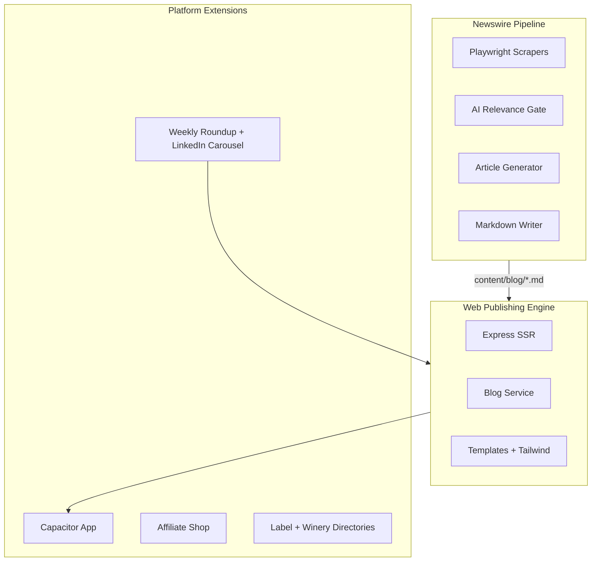
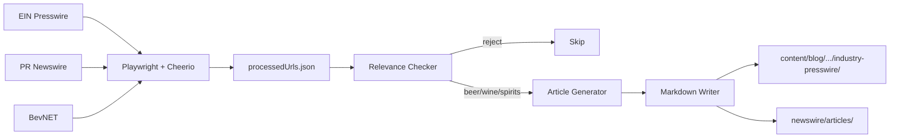
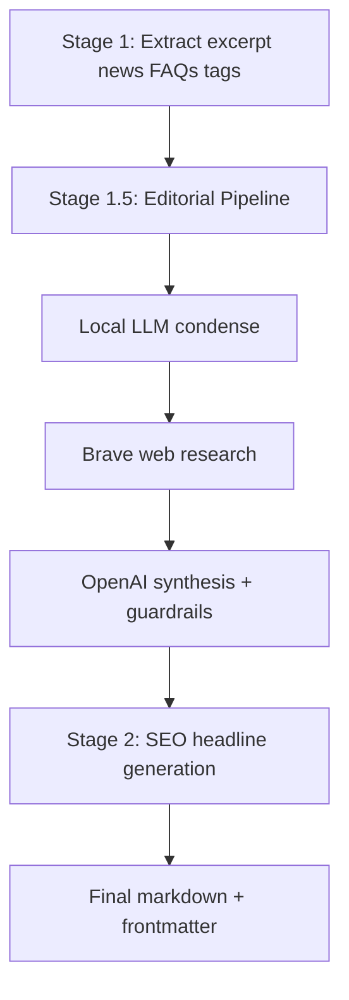

# BevWire — Portfolio Case Study

**A file-based content management and publishing platform for the beverage industry**

Live site: [bevwire.com](https://bevwire.com)

---

## Contents

1. [Overview](#overview)
2. [The Problem I Solved](#the-problem-i-solved)
3. [System Architecture](#system-architecture)
4. [File-Based CMS Engine](#file-based-cms-engine)
5. [Newswire: Scraper to Published Article](#newswire-scraper-to-published-article)
6. [AI Editorial Pipeline (Deep Dive)](#ai-editorial-pipeline)
7. [Content Discovery and Linking](#content-discovery-and-linking)
8. [Platform Extensions](#platform-extensions)
9. [Technology Stack](#technology-stack)
10. [Challenges and Design Decisions](#challenges-and-design-decisions)
11. [Impact and Scale](#impact-and-scale)
12. [What's Next](#whats-next)

---

## Overview

I built **BevWire** as a full-stack digital publishing platform for beverage industry news. At its core, it is a **markdown-native content management system** with no editorial database: every article, report, and static page lives as a file on disk with YAML frontmatter, served by an Express server that renders HTML on each request.

What makes BevWire more than a blog engine is the automation wrapped around it. I designed and implemented **Newswire**, an AI-assisted content pipeline that scrapes press releases from industry wire services, filters them for relevance, runs them through a multi-stage editorial synthesis process, and publishes finished articles into the live site — often within minutes of a release going live.

The platform also includes satellite products built on the same foundation: a Capacitor mobile app, affiliate shop, searchable beer label archive, winery directory, weekly industry roundups, LinkedIn carousel generation, email-gated market reports, and automated internal linking across more than a thousand published articles.

This document is the technical and architectural reference I use when explaining the system on a portfolio site. It is written in first person and focuses on engineering decisions, data flows, and capabilities — not business pricing or revenue.

---

## The Problem I Solved

### CMS overhead without a CMS

Traditional publishing stacks assume a database, an admin panel, and a build pipeline. For a solo-operated industry publication covering beer, wine, and spirits, that overhead did not match the workload. Content is write-once and read-many. Editors (in my case, mostly automation plus occasional manual pieces) produce markdown files; readers consume them on the web.

I chose **file-based storage** so every article is git-trackable, human-readable, and editable with any text editor. There are no migrations, no ORM, and no risk of SQL injection on editorial content.

### Volume that manual curation cannot handle

Beverage companies publish dozens of press releases daily across EIN Presswire, PR Newswire, BevNET, and similar services. Reading each release, deciding whether it matters, assigning a category, and writing a useful summary does not scale by hand.

I needed a pipeline that could ingest high-volume, low-signal input and produce low-volume, high-signal output — without letting irrelevant corporate announcements through.

### Discovery without manual tagging drudgery

Once articles exist, readers need to find related coverage. I did not want to manually curate "related posts" widgets on every page. The system needed **machine-assigned tags**, scoring algorithms, and automated internal links so discovery improved as the corpus grew.

---

## System Architecture

BevWire is a **dual-component system**: a content aggregation pipeline (`newswire/`) and a web publishing engine (repository root). They share a filesystem contract — markdown files under `content/blog/` — but use different module systems on purpose.



### Module boundary

| Component | Location | Module system | Role |
|-----------|----------|---------------|------|
| Web engine | Repository root | CommonJS | Express server, routing, templates, content services |
| Newswire | `newswire/` | ES modules | Scrapers, AI pipeline, CLI tools |
| Mobile app | `bevwire-app/` | Capacitor 6 | Native shell loading production SSR in a WebView |

The split is intentional. Newswire uses modern ES module patterns (top-level await, clean imports with Playwright and OpenAI SDK). The web engine stays on CommonJS for broad Express middleware compatibility. Both components are optimal for their jobs; they communicate through markdown files, not shared runtime imports.

### Storage model

There is **no editorial database**. SQLite appears only for ancillary features (lead-magnet email signups, label archive, winery directory, affiliate shop catalog). All published articles are markdown with YAML frontmatter.

---

## File-Based CMS Engine

The web publishing engine is the magazine readers see at bevwire.com. I modeled it loosely as MVC: markdown files are the model, JavaScript string templates with Tailwind CSS are the view, and Express route handlers are the controller.

### Content model

Articles live in a hierarchical folder structure:

```
content/blog/
├── beer/
│   ├── industry-presswire/    (AI-generated; URLs use section key industry-press)
│   ├── brewery-deep-dive/
│   ├── editorials/
│   ├── reports/
│   ├── lists/
│   └── tails-ales-trails/
├── wine/
│   ├── industry-presswire/
│   ├── editorials/
│   ├── reports/
│   └── lists/
└── spirits/
    ├── industry-presswire/
    ├── editorials/
    ├── reports/
    └── lists/
```

Each file carries YAML frontmatter. A typical industry-press article includes:

```yaml
title: "Glass Bottle Expansion: Coca‑Cola Consolidated Adds $35M Line at Indianapolis Facility"
slug: glass-bottle-expansion-cocacola-consolidated-adds-35m-line-a
date: 2026-05-21
author: Sarah Chen
excerpt: "Coca-Cola Consolidated to Invest $35 Million..."
section: beer/industry-press
tags: ["Bottles", "Glass Packaging", "Manufacturing Expansion"]
faq: [{ question: "...", answer: "..." }]
braveCitations: [{ url: "https://...", title: null }]
companies: [{ name: "Coca-Cola Consolidated", slug: "coca-cola-consolidated" }]
```

Note the distinction between **folder names** (`industry-presswire`) and **section keys** (`beer/industry-press`). Folder names reflect filesystem organization; section keys drive URLs, navigation, and filtering. I map between them in `config.js` and `services/blog.js`.

### Section configuration

Site structure is declared once in `config.js` and drives navigation, sitemap generation, and the Capacitor app's native tabs:

```javascript
sections: [
  { key: 'beer', label: 'Beer', children: [
    { key: 'beer/industry-press', label: 'Industry Press Analysis' },
    { key: 'beer/brewery-deep-dive', label: 'Brewery Deep Dive' },
    { key: 'beer/editorials', label: 'Editorials' },
    { key: 'beer/reports', label: 'Reports' },
    { key: 'beer/lists', label: 'Lists & guides' }
  ]},
  // wine and spirits follow the same pattern
]
```

The same `appNav` block in `config.js` is the single source of truth for web header links, footer menus, and native mobile navigation — synced to Android XML and iOS Swift via a code generator script.

### Content loading and caching

`services/blog.js` recursively scans `content/blog/`, parses frontmatter with `js-yaml`, and builds an in-memory index sorted by date. I invalidate the cache using a fingerprint of file count plus maximum modification time — when any markdown file changes, the index rebuilds on the next request.

This gives me always-fresh content without a separate build step or cache invalidation service.

### Routing and SEO

`routes/blog.js` handles:

- Magazine-style homepage with hero, latest grid, and per-section carousels
- Hierarchical section pages (`/section/beer`, `/section/beer/industry-press`)
- Article pages at flat URLs (`/beer/industry-press/article-slug`)
- Author profiles, company hub pages, site search, newsletter hub
- Dynamic XML sitemap and IndexNow URL submission
- JSON-LD structured data (Article, FAQPage, Organization, CollectionPage)
- Public APIs (`/api/read-finder-index.json`, `/api/companies/search`)
- Internal RAG API for industry-press markdown export (key-gated)

### Article presentation patterns

AI-generated industry press articles follow **The Takeaway pattern**:

1. **The News** — a short, factual summary in a light-blue callout (`.article-news`)
2. **The Takeaway** — a longer editorial analysis in a warm-orange callout (`.article-takeaway`)
3. **Original Press Release** — the full scraped source for readers who want the unfiltered announcement
4. **Sources consulted** — vetted web research citations when the editorial pipeline used Brave Answers

Manual editorial content (deep dives, reports, lists) uses standard markdown without this structure.

### Homepage curation logic

Industry press is valuable but secondary to original editorial. I exclude industry-press articles from the homepage hero and the "latest stories" column unless explicitly pinned via config. The hero prioritizes editorials, brewery deep dives, and reports. A separate "Breaking News Analysis" column surfaces the five newest industry-press posts site-wide.

Industry press list cards use a shared press icon (`pressicon.avif`) instead of lead images — I removed per-article hero images from the pipeline to keep wire content visually distinct from editorial work.

### Distribution and monetization (high level)

- Google AdSense meta tags on all server-rendered pages
- Beehiiv newsletter integration with delayed bottom-sheet signup prompt
- Email-gated PDF market reports delivered via Amazon SES (SQLite signup tracking)
- Affiliate shop at `/shop` (separate subsystem; see Platform Extensions)

---

## Newswire: Scraper to Published Article

Newswire is the automated content pipeline I built in `newswire/`. It follows a **pipeline-with-gates** pattern: scrape everything, filter aggressively, generate only what passes.



### Scraping layer

Three source-specific scrapers use **Playwright** for browser automation (JavaScript-rendered listing pages) and **Cheerio** for fast HTML parsing:

| Scraper | Source | Notes |
|---------|--------|-------|
| `einScraper.js` | EIN Presswire | Paginated listing + article pages |
| `prNewswireScraper.js` | PR Newswire | Paginated consumer products feed |
| `bevnetScraper.js` | BevNET PR | Two-week date filter, no pagination |

Each scraper extracts title, source URL, date, excerpt, and full body HTML. I run the CLI with:

```bash
cd newswire
npm run scrape -- --start-page 1 --end-page 5
```

### Deduplication

`newswire/data/processedUrls.json` tracks every processed source URL. Re-runs skip already-ingested releases unless I pass `--force`. This makes the pipeline idempotent — safe to schedule daily without creating duplicates.

### Relevance gate

`relevanceChecker.js` sends the full press release body to an AI model with strict criteria:

- Must be **primarily** about beverage alcohol (beer, wine, spirits, cider, hard seltzer, mead) or suppliers clearly serving that trade
- Generic logistics, multi-sector market reports, and tangential industries are rejected
- Assigns exactly one category: `beer`, `wine`, or `spirits` (no "general" bucket)

The gate reads the full scraped body, not just listing teasers — long bodies truncate at ~48k characters before the API call.

### Dual write

`markdownWriter.js` writes every approved article twice:

1. **Archive copy** — `newswire/articles/{slug}.md` (preserves the generation output)
2. **Live copy** — `content/blog/{category}/industry-presswire/{slug}.md` (served by the website)

Category routing is automatic based on the relevance checker's `primaryCategory`.

### Output structure (annotated sample)

Here is what a finished industry-press article looks like — excerpted from a Coca-Cola Consolidated glass bottling investment story:

**Frontmatter** carries SEO title, tags, FAQ schema, Brave research citations, and company hub links.

**The News** (factual, 1–2 paragraphs):

> Coca-Cola Consolidated announced a $35 million investment in Indianapolis to expand its manufacturing capabilities. The company plans to add a new glass bottle production line at its facility located at 5000 W. 25th Street, with construction set to begin in late 2026...

**The Takeaway** (editorial analysis, ~500–700 words):

> The news that Coca‑Cola Consolidated is adding a new glass bottle line to its Indianapolis plant might be framed as another capital‑expenditure headline, yet for those watching ingredient flows it signals a move toward premium packaging that could ripple through the supply chain...

**Original Press Release** (full scraped source, preserved verbatim below a rule line).

**Sources consulted** (vetted URLs from web research, rendered as a bullet list).

This three-layer structure lets readers scan the summary, read the analysis, or drill into the primary source — all on one page.

---

## AI Editorial Pipeline

The article generator is the most complex part of Newswire. I split it into discrete stages so each step has a narrow job and failures are isolated.



### Stage 1: Structured extraction

A single OpenAI-compatible call produces:

- **EXCERPT** — short natural summary for frontmatter
- **NEWS_SUMMARY** — factual who/what/when (becomes "The News")
- **FAQS** — 3–5 question/answer pairs for FAQPage JSON-LD
- **TAGS** — 3–5 industry tags for discovery (`Packaging`, `Distribution`, `M&A`, etc.)

There is no takeaway bullet block at this stage anymore. The long-form editorial content comes from Stage 1.5.

### Stage 1.5: Editorial pipeline

`editorialPipeline.js` is where raw press releases become readable analysis. The flow:

1. **Condense** — a local LLM strips the PR to proper nouns, numbers, dates, and checkable claims (~120k char input cap)
2. **Domain notes** — keyword-scored industry primers inject guardrails (distribution logic, regulatory constraints, B2B vs retail tier discipline)
3. **Brave Answers** — web research via Brave's chat API adds external context and citations
4. **Template pick** — ~60/40 split between contrarian and compatibility templates, weighted by research depth
5. **Streaming synthesis** — long-form takeaway prose with strict grounding rules
6. **Language pass** — trims AI-sounding patterns, enforces prose flow
7. **Information-gain guardrail** — audits thesis, retail math, ownership claims, regulatory advice

Key design constraints I enforced in prompts:

- **Numerical synthesis only when every operand appears** in PR or Brave research — no invented market-capture math
- **Distributor advice is conditional** on PR type (exclusive deal vs general launch vs premises-only SKU)
- **Superlatives require evidence** — no "largest" or "first" without input support
- **Regulatory guardrail** — never advise bypassing three-tier system or TTB rules
- **Opening paragraph** orients the reader before structured analysis begins
- **Target length** — 495–715 words for the takeaway column

Brave citations are vetted one-by-one by the condenser model; social/UGC hosts are blocklisted. Surviving citations populate `braveCitations` frontmatter and render as a "Sources consulted" footer.

An optional **ownership/competitor guardrail** extracts `companies` frontmatter (`{ name, slug }`) for company hub pages at `/company/:slug`.

### Stage 2: SEO headline

After editorial synthesis completes, a separate call generates an optimized headline:

- Never reuses the wire headline verbatim
- Maximum 80 characters
- Leads with named company, brand, or product when available
- Tuned for trade and analytical search intent

Example transformation: *"Acme Corp Announces Q3 Earnings"* → *"Acme Corp's Q3 Realignment Reshapes Spirits Distribution Network"*

### Author personas

Each generated article assigns a random author from `content/authors.json` for its beverage category. Each persona has a `voice` field that drives synthesis tone — synthetic news-desk journalists with distinct specialties (distribution, sustainability, bar culture, etc.).

### Post-publish editorial touch-ups

`scripts/industry-press-touch-ups.mjs` applies deterministic editorial notes to ~1-in-5 industry-press articles: verification notes, added context lines, or cross-reference callouts. This is a lightweight authenticity pass, not a rewrite.

### Failure handling

If the editorial pipeline throws after retries, the article is not written. The scrape run logs the error, increments error stats, and moves on. Partial output never reaches the live site.

---

## Content Discovery and Linking

Publishing articles is half the job. I built several systems so readers (and search engines) find related content without manual curation.

### Tag-based related posts

`getRelatedPosts()` in `services/blog.js` scores every other article against the current one:

```javascript
// Tag matching: +3 points per matching tag
score += matchingTags.length * 3;

// Same category: +2 points
if (pCategory === currentCategory) score += 2;

// Same subcategory type: +1 point
if (pType && pType === currentType) score += 1;
```

The top-scoring posts appear in sidebar widgets. Separate helpers restrict results to evergreen content (excluding industry press) or pillar content for gateway list pages.

### Automated internal linking

`services/contentLinker.js` injects up to four internal links per article before markdown rendering:

1. **Tag-driven pass** — score eligible targets with the same weights as related posts, pick anchor text from overlapping tags or title words
2. **Term fallback** — n-gram extraction with confidence scoring on editorial plain text

Industry press is never a link target (only evergreen content receives auto-links). The original press release block is never modified. Opportunities cache in `data/internalLinks.json` with a content fingerprint for invalidation.

### Structured data and search

- **FAQPage JSON-LD** from frontmatter `faq` arrays (generated in Stage 1)
- **Article schema** with author Person nodes and publisher Organization
- **Company hub pages** with CollectionPage + about Organization
- **Dynamic sitemap** covering articles, sections, authors, companies, label directory, winery directory, and shop products
- **IndexNow** submission on content changes
- **`/llms.txt`** for LLM/agent discovery of site structure and API endpoints
- **Read finder** — client-side Fuse.js search over a JSON article index with ETag caching

---

## Platform Extensions

These subsystems share the monorepo but are shorter sections — each solves a specific product need beyond core CMS + Newswire.

### Weekly industry roundup

`newswire/src/weekly-roundup/` collects recent industry-press posts for one beverage vertical, curates them with OpenAI, reduces the corpus via OpenRouter, and synthesizes a single weekly report into `content/blog/{industry}/reports/weekly-roundup-{industry}-{date}.md`.

The output includes prominent stories, cross-cutting trends, analysis, operator takeaways, and a "what to watch" section — with internal links back to source press articles.

CLI: `npm run weekly-roundup -- --industry beer`

### LinkedIn carousel PDF

`newswire/scripts/linkedin-carousel.mjs` picks a random industry-press article from the last 21 days, generates three insight blocks plus a post caption via local LLM, and renders a 5-page branded PDF with pdfkit. Output goes to `output/linkedin-carousels/` (local only, not served by the website).

This is off-site marketing automation — useful for social distribution without touching the web stack.

### Capacitor mobile app

`bevwire-app/` is a Capacitor 6 project that loads bevwire.com in a native WebView. I did not bundle article HTML locally; the app is a shell around production SSR.

Key design choices:

- **Single nav source** — `config.appNav` generates Android `more_menu.xml`, iOS `NavConfig.generated.swift`, and `nav.generated.json`
- **Embed mode** — when the User-Agent contains `BevWireApp`, the server hides duplicate site chrome and shows native bottom tabs
- **Bridge script** — `bevwire-capacitor-bridge.js` handles Share, splash hide, network overlay, and a floating Share FAB

Bottom tabs: Home, Beer, Wine, Spirits, Search. Push notifications are not integrated yet.

### Beer label directory

Merged from a legacy label archive project. SQLite-backed search at `/labels` with JPEG assets under `public/labels/`. Legacy URL 301 redirects preserve SEO from the old domain structure.

### Winery directory

SQLite catalog at `/wineries` with structured data, FAQ content, and weather forecast integration (SevenTimer API). Uses the same blog layout with Capacitor embed support.

### Affiliate shop

Modular provider-pattern storefront at `/shop`. Phase 1 ships a Wine.com affiliate catalog (~3,300 products) with Fuse.js client search, SSR first page, and Merchant Listings JSON-LD on detail pages.

Architecture supports adding future providers (merch, direct inventory) without rewriting the catalog shell. See `shop/ARCHITECTURE.md` for the provider contract.

---

## Technology Stack

| Layer | Technologies |
|-------|-------------|
| **Web server** | Node.js, Express 5.2, marked 17, js-yaml |
| **Styling** | Tailwind CSS v4 (CDN), custom CSS in `public/styles.css` |
| **Scraping** | Playwright, Cheerio |
| **AI — extraction & relevance** | OpenAI-compatible API (local LM default: gpt-oss-20b) |
| **AI — editorial synthesis** | OpenAI-compatible streaming client, Brave Answers API |
| **AI — weekly roundup** | OpenAI (curation) + OpenRouter (reduce + synthesis) |
| **Image processing** | Sharp (resize to 800px, JPEG conversion) |
| **CLI** | Commander.js |
| **Email** | AWS SES (`@aws-sdk/client-ses`) for lead-magnet PDF delivery |
| **Ancillary storage** | sqlite3 (lead magnets, labels, wineries, shop catalog) |
| **Mobile** | Capacitor 6 (Android + iOS) |
| **Client search** | Fuse.js 7.3 (read finder, shop catalog) |
| **PDF generation** | pdfkit (LinkedIn carousels), Playwright (lead-magnet reports) |

### Deployment

- Express behind Let's Encrypt SSL (auto-detected in `server.js`)
- File-system content — no build step for CSS or articles
- Newswire scrape runs on a schedule or manually via CLI
- Git tracks all markdown content; binary assets (images, PDFs) managed separately

---

## Challenges and Design Decisions

### Why file-based over WordPress or a headless CMS

I weighed a traditional CMS against markdown-on-disk. For a publication with hundreds to low thousands of articles, the file approach wins on simplicity: version control, no migrations, human-readable content, instant publish on file write. The trade-off is no complex querying and no concurrent editing safeguards — acceptable for a single-operator publication.

### Why server rendering over static generation

I chose SSR on each request rather than a static site generator. With in-process caching in `blog.js`, performance is fine at this scale. The win is zero build step: scrape a press release, write a markdown file, and it is live on the next HTTP request.

### AI authenticity without a human editor on every piece

The biggest risk in automated publishing is sounding like a robot — or worse, hallucinating facts. I addressed this with layered mitigations:

- Grounding rules that forbid inventing numbers not present in inputs
- Brave web research with per-URL citation vetting
- Multi-pass guardrails (synthesis → language pass → information-gain audit)
- Anti-buzzword prompt engineering ("write like you're telling a friend at a bar")
- Deterministic post-publish touch-ups on a subset of articles
- Publisher standards page explaining the pipeline to readers

### Relevance gate evolution

Early versions required Midwest US geographic relevance and included a "general" category. I removed both as BevWire expanded to national/international beverage coverage with three strict categories. The gate also dropped "craft-only" language — the publication covers mass market through premium segments.

### Visual hierarchy between wire and editorial

Industry press gets icon-based list cards, no homepage hero placement, and cross-link banners to editorial subcategories. This keeps automated wire content from crowding out the deep dives and reports that define the publication's editorial identity.

### Dual module systems

Maintaining ES modules in Newswire and CommonJS at the root adds a boundary, but it keeps each component on its best footing. They do not import each other — the filesystem is the integration point.

### Security

API keys live in environment variables and `.env` files (gitignored). The RAG API for raw markdown export is key-gated and not listed on the public API docs page. Lead-magnet PDFs live outside `public/` and are delivered only via email after signup.

---

## Impact and Scale

BevWire today operates as a full publishing stack from a single monorepo:

| Indicator | Scale |
|-----------|-------|
| Total published articles | 1,015 markdown files |
| Industry press — beer | 231 articles |
| Industry press — wine | 119 articles |
| Industry press — spirits | 495 articles |
| Beverage verticals | 3 (beer, wine, spirits) |
| Press sources monitored | 3 (EIN, PR Newswire, BevNET) |
| Major subsystems | 8 (web engine, Newswire, weekly roundup, LinkedIn carousel, mobile app, label directory, winery directory, affiliate shop) |

### Daily operations cadence

A typical day:

1. Run the Newswire scrape (automated or manual) — new press releases flow through relevance check, AI generation, and dual write
2. Editorial and report content is written or assisted manually in section folders
3. Optional: generate a weekly roundup or LinkedIn carousel for distribution
4. Express serves updated content immediately — no deploy step for article changes beyond file sync

Processed wire URLs are tracked to prevent duplicate ingestion. Frontmatter dates drive recency filters (carousel pool, homepage ordering, ticker).

### What this demonstrates

- End-to-end system design from data ingestion through AI processing to multi-channel publishing
- File-based architecture that scales to thousands of articles without a CMS database
- Multi-stage AI pipeline with grounding, guardrails, and structured output
- Content discovery through tags, scoring, and automated internal linking
- Product thinking beyond a blog — mobile app, directories, shop, and marketing automation from shared infrastructure

I have deliberately omitted traffic analytics, revenue figures, and partner pricing from this document.

---

## What's Next

Honest forward-looking items, not a roadmap promise:

- **Push notifications** in the Capacitor app (FCM/APNs + backend needed)
- **Expanded beverage categories** (cider, NA beer, etc.) — requires config, folder structure, and relevance checker prompt updates
- **Multi-provider shop** — architecture supports it; only Wine.com is live
- **Hierarchical article URLs** — currently flat slugs; breadcrumb routing is planned
- **Static generation layer** — if article volume grows past in-process cache comfort, a hybrid SSR + CDN cache is the natural next step

---

*Document generated from the BevWire repository, July 2026. For internal system documentation maintained alongside the codebase, see `analysis.md`.*
