# BrewLedger – Systems and Implementation Diagram

## How to view the graphs

The diagrams in this file are **Mermaid** code blocks. To see them as visual graphs:

1. **Open the preview in your browser (quickest)**  
   Open **`docs/diagram-preview.html`** in a browser (double‑click the file or right‑click → Open with → your browser). It renders the master network graph with no extensions or copy‑paste. Requires internet (Mermaid loads from CDN).

2. **Mermaid Live Editor**  
   Open [https://mermaid.live](https://mermaid.live), paste a `mermaid` code block from this file into the editor, and the graph renders on the right. Copy from the first `flowchart` line through the closing ` ``` `.

3. **GitHub**  
   Push this repo and open `docs/SYSTEMS-AND-IMPLEMENTATION-DIAGRAM.md` on GitHub. The rendered markdown preview shows Mermaid diagrams as graphs.

4. **Cursor / VS Code**  
   Use **Markdown: Open Preview** (e.g. right‑click the file → Open Preview, or `Ctrl+Shift+V`). If diagrams still show as code, install the **Markdown Preview Mermaid Support** extension so Mermaid blocks render as graphs.

---

## How to read this document

This document is a **layered tree** from big to small: system context → repository layout → technology stack → subsystems → key flows → UI and API maps. Each level has one or more Mermaid diagrams. Use the **Master tree** below to jump to any level. Cross-references use "See Level X" or "Above: Level X."

**Master tree (at-a-glance navigation):**

| Level | Section | Description |
|-------|---------|-------------|
| — | [**Master network**](#master-network--undirected-node-graph) | **Undirected node graph: one interconnected visual of all components** |
| 0 | [System context](#level-0--system-context) | BrewLedger in the world: users, backend, Stripe, TTB |
| 1 | [Repository and platforms](#level-1--repository-and-platforms) | server/, brewledger-app/, console/ and how they connect |
| 2 | [Technology stack and data stores](#level-2--technology-stack-and-data-stores) | Vue, Capacitor, Express, SQLite, IndexedDB, sync boundary |
| 3 | [Subsystems](#level-3--subsystems) | Auth, Sync, Billing, Inventory/Ledger, Batch/Recipe, TTB |
| 4 | [Key flows](#level-4--key-flows) | Sync–Ledger–cache, TTB data flow, Billing–sync–UI |
| 5 | [UI and API map](#level-5--ui-and-api-map) | Mobile/console views and server API tree |
| — | [Changes and bugs mapping](#changes-and-bugs-mapping) | change docs and BUGS-AND-FIXES-LOG mapped to diagram nodes |

---

## Master network – undirected node graph

One interconnected graph of major system components. Edges are undirected (no arrows); each line means "connects to" or "integrates with." Use this for a single visual overview of the whole system.

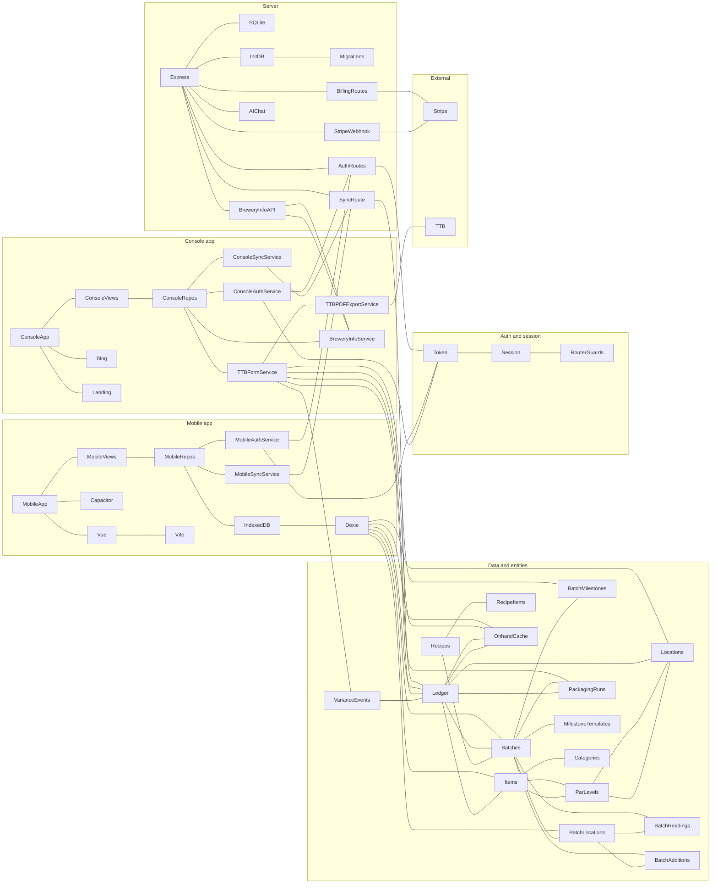

**Pure network (no subgraphs)** – same nodes as one undirected web:

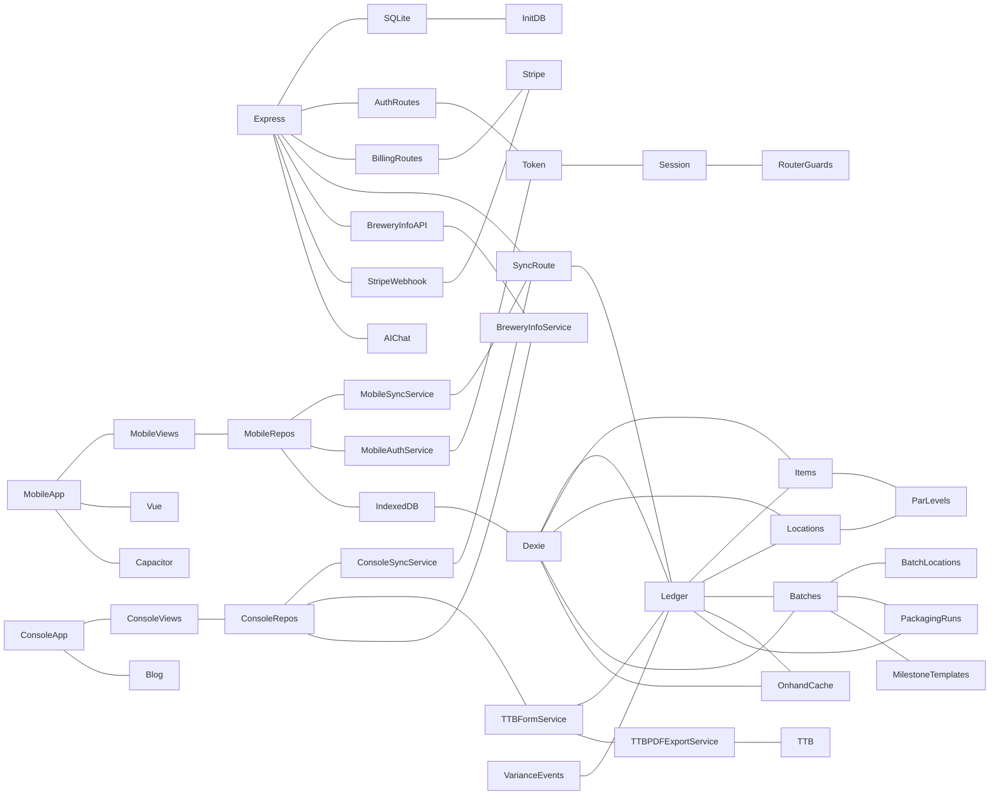

*Below: [Level 0 – System context](#level-0--system-context) (layered tree).*

---

## Level 0 – System context

BrewLedger in the world: mobile and desktop clients, shared backend, Stripe for billing, and TTB as external reporting target.

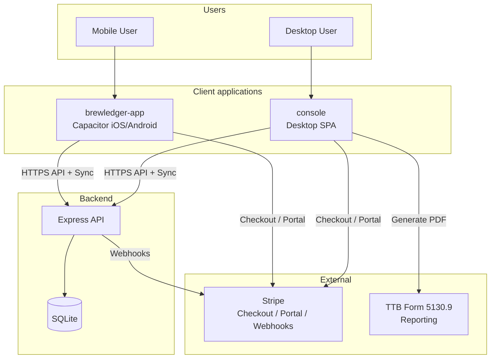

*Above: Master tree | Next: [Level 1 – Repository and platforms](#level-1--repository-and-platforms)*

---

## Level 1 – Repository and platforms

Repository layout: `server/`, `platforms/brewledger-app/`, `platforms/console/` with key entrypoints and connections.

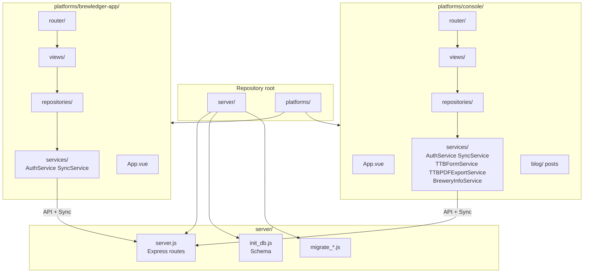

*Above: [Level 0](#level-0--system-context) | Next: [Level 2 – Technology stack](#level-2--technology-stack-and-data-stores)*

---

## Level 2 – Technology stack and data stores

Stack and persistence: Vue 3, Vite, Capacitor 6, Express, dual database (SQLite server, IndexedDB client via Dexie), Stripe, JWT-like auth.

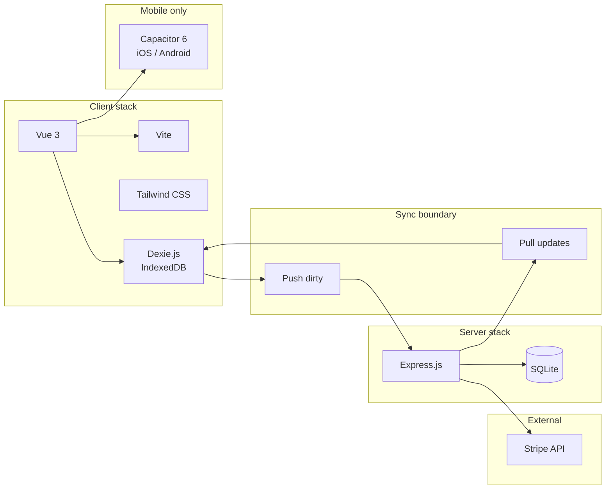

*Above: [Level 1](#level-1--repository-and-platforms) | Next: [Level 3 – Subsystems](#level-3--subsystems)*

---

## Level 3 – Subsystems

Orchestrated subsystems: Auth, Sync, Billing, Inventory/Ledger, Batch/Recipe, TTB. Each subsection has one diagram.

### 3.1 Auth and session

Login/register → token → session (localStorage) → router guards → API; org scoping.

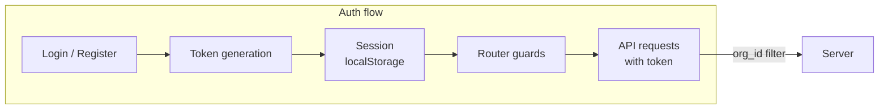

*See Level 3 index above | Next: [3.2 Sync](#32-sync-and-replication)*

### 3.2 Sync and replication

Gather dirty → push `/api/sync` → server validate/apply → pull updates → apply locally; server authoritative.

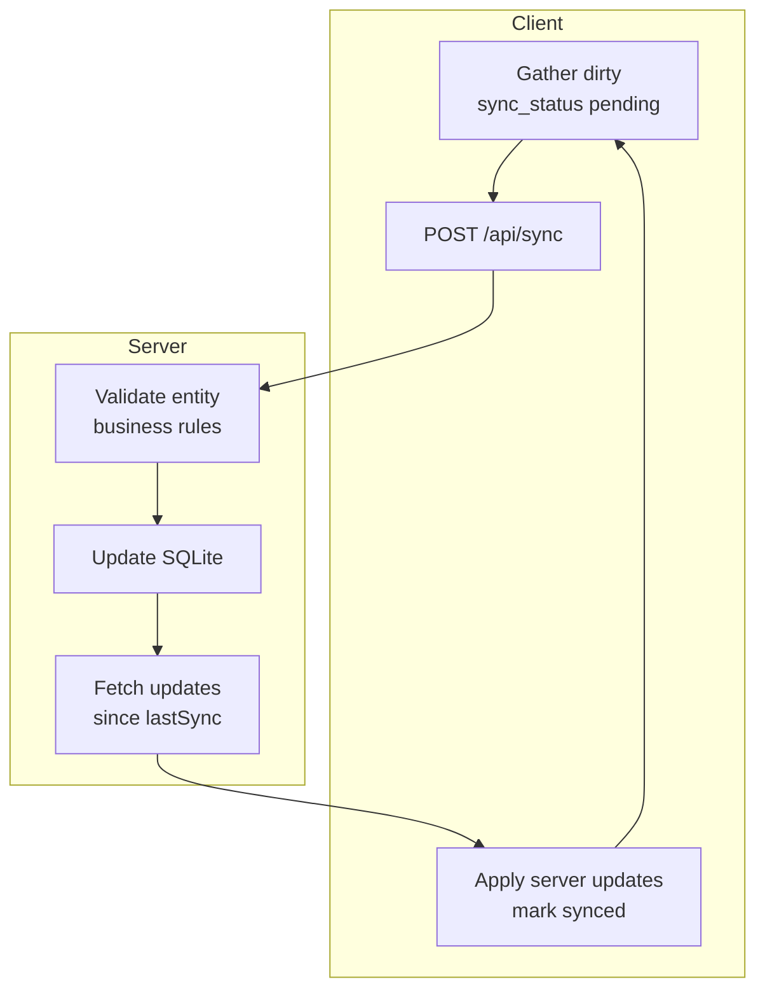

*Above: [3.1 Auth](#31-auth-and-session) | Next: [3.3 Billing](#33-billing-and-subscription)*

### 3.3 Billing and subscription

Stripe webhook → org status → sync propagation → router guard; checkout, portal, success-redirect, portal-return; single-tier (100 locations).

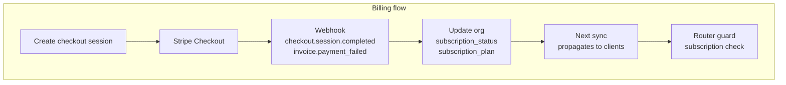

*Above: [3.2 Sync](#32-sync-and-replication) | Next: [3.4 Inventory and ledger](#34-inventory-and-ledger)*

### 3.4 Inventory and ledger

Items, Locations, Ledger (RECEIVE, CONSUME, TRANSFER, etc.), onhand_cache, ParLevels (individual + global); connection to sync and TTB.

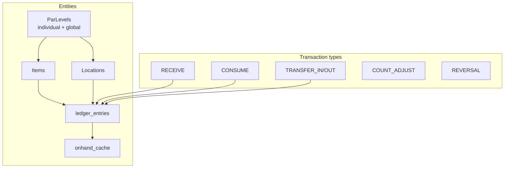

*Above: [3.3 Billing](#33-billing-and-subscription) | Next: [3.5 Batch and recipe](#35-batch-and-recipe)*

### 3.5 Batch and recipe

Batches, batch_locations (vessel splits), batch_readings, batch_additions, batch_volume_adjustments, milestones (forced Production Complete), recipes/recipe_items, packaging runs; link to ledger (beer RECEIVE, batch_id).

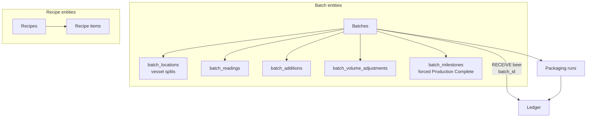

*Above: [3.4 Inventory](#34-inventory-and-ledger) | Next: [3.6 TTB Form 5130.9](#36-ttb-form-51309)*

### 3.6 TTB Form 5130.9

Beer-as-items, Finished Beer category/item, location stage (cellar | racking_keg | bottling_bulk | case), TTBFormService (lines 1–34, columns a–e), TTBPDFExportService, brewery-info API; data flow from BatchDetail / Racking / Removals / Losses / Packaging → ledger → form/PDF.

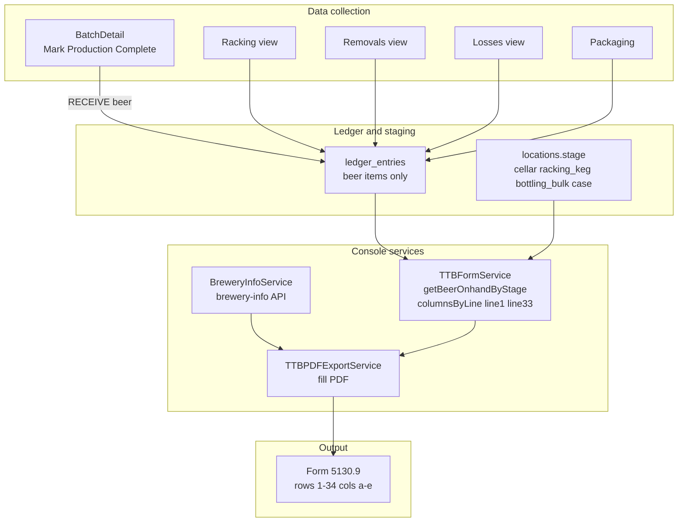

*Above: [3.5 Batch](#35-batch-and-recipe) | Next: [Level 4 – Key flows](#level-4--key-flows)*

---

## Level 4 – Key flows

Interconnections: Sync–Ledger–cache, TTB data flow, Billing–sync–UI.

### 4.1 Sync ↔ Ledger ↔ cache

User action → Ledger entry → cache update → pending → sync → server → other devices.

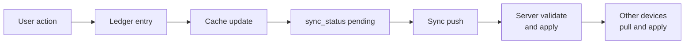

*Next: [4.2 TTB data flow](#42-ttb-data-flow)*

### 4.2 TTB data flow

BatchDetail (production complete RECEIVE), Racking, Removals, Losses, Packaging → ledger + variance → TTBFormService → columnsByLine / getBeerOnhandByStage → TTBPDFExportService.

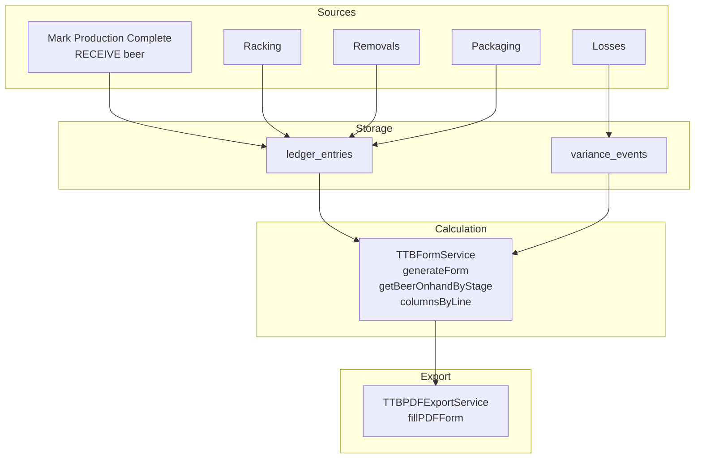

*Above: [4.1 Sync–Ledger–cache](#41-sync--ledger--cache) | Next: [4.3 Billing–sync–UI](#43-billing--sync--ui)*

### 4.3 Billing ↔ sync ↔ UI

Webhook → DB → next sync → session update → router guard enforcement.

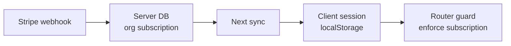

*Above: [4.2 TTB](#42-ttb-data-flow) | Next: [Level 5 – UI and API map](#level-5--ui-and-api-map)*

---

## Level 5 – UI and API map

### 5.1 Mobile (brewledger-app) view tree

Router → views → repositories → SyncService / AuthService; Capacitor deeplinks (brewledger://settings, brewledger://billing/success).

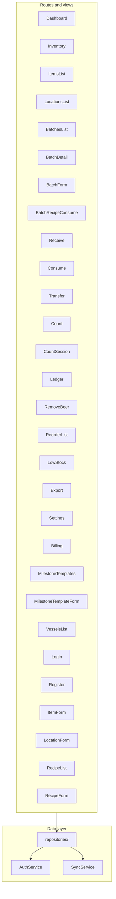

*Next: [5.2 Console view tree](#52-console-view-tree)*

### 5.2 Console view tree

Landing (/), Dashboard, Inventory, Ledger, BatchesList, BatchDetail, BatchForm, Reports (TTBForm), Removals, Racking, Losses, ParLevels, Settings, Blog (The Ledger), AIAssistant, CsvSearch → repositories + TTBFormService / BreweryInfoService / TTBPDFExportService.

```mermaid
flowchart TB
  subgraph consoleRoutes [Routes and views]
    Landing[Landing /]
    DashboardC[Dashboard]
    InventoryC[Inventory]
    LedgerC[Ledger]
    BatchesListC[BatchesList]
    BatchDetailC[BatchDetail]
    BatchFormC[BatchForm]
    BatchRecipeConsumeC[BatchRecipeConsume]
    Reports[Reports]
    TTBForm[TTBForm]
    Removals[Removals]
    Racking[Racking]
    Losses[Losses]
    ParLevels[ParLevels]
    Analytics[Analytics]
    SettingsC[Settings]
    MilestoneTemplatesC[MilestoneTemplates]
    MilestoneTemplateFormC[MilestoneTemplateForm]
    BlogList[BlogList /blog]
    BlogPost[BlogPost /blog/:slug]
    LedgerAbout[LedgerAbout]
    LedgerSubscribe[LedgerSubscribe]
    LedgerSection[LedgerSection]
    CsvSearch[CsvSearch]
    AIAssistant[AIAssistant]
    LoginC[Login]
    RegisterC[Register]
  end

  subgraph consoleLayer [Data and services]
    ReposC[repositories/]
    TTBFormService[TTBFormService]
    TTBPDFExportService[TTBPDFExportService]
    BreweryInfoService[BreweryInfoService]
    AuthServiceC[AuthService]
    SyncServiceC[SyncService]
  end

  consoleRoutes --> ReposC
  consoleRoutes --> TTBFormService
  consoleRoutes --> BreweryInfoService
  TTBForm --> TTBPDFExportService
  ReposC --> SyncServiceC
  ReposC --> AuthServiceC
```

*Above: [5.1 Mobile](#51-mobile-brewledger-app-view-tree) | Next: [5.3 Server API tree](#53-server-api-tree)*

### 5.3 Server API tree

Health, Auth, Billing, Orgs (brewery-info), Item-templates, Locations, Sync, AI, static + SPA fallback.

```mermaid
flowchart TB
  subgraph apiTree [Server API]
    Health[GET /health]
    Auth[Auth]
    BillingAPI[Billing]
    OrgsAPI[Orgs]
    ItemTemplates[Item-templates]
    LocationsAPI[Locations]
    SyncAPI[Sync]
    AIAPI[AI]
    Static[Static + SPA fallback]
  end

  subgraph authRoutes [Auth]
    RegisterOrg[POST /api/auth/register-org]
    LoginRoute[POST /api/auth/login]
    Invite[POST /api/auth/invite]
  end

  subgraph billingRoutes [Billing]
    SuccessRedirect[GET /api/billing/success-redirect]
    PortalReturn[GET /api/billing/portal-return]
    CreateCheckout[POST /api/billing/create-checkout-session]
    ConfirmSub[POST /api/billing/confirm-subscription]
    CancelSub[POST /api/billing/cancel-subscription]
    CreatePortal[POST /api/billing/create-portal-session]
  end

  subgraph webhooks [Webhooks]
    StripeWebhook[POST /api/webhooks/stripe]
  end

  subgraph orgRoutes [Orgs]
    GetBreweryInfo[GET /api/orgs/:orgId/brewery-info]
    PutBreweryInfo[PUT /api/orgs/:orgId/brewery-info]
  end

  subgraph otherRoutes [Other]
    GetItemTemplates[GET /api/item-templates]
    GetItemTemplateId[GET /api/item-templates/:id]
    ImportItemTemplates[POST /api/item-templates/import]
    PostLocations[POST /api/locations]
    PostSync[POST /api/sync]
    PostAIChat[POST /api/ai/chat]
  end

  Auth --> RegisterOrg
  Auth --> LoginRoute
  Auth --> Invite
  BillingAPI --> SuccessRedirect
  BillingAPI --> PortalReturn
  BillingAPI --> CreateCheckout
  BillingAPI --> ConfirmSub
  BillingAPI --> CancelSub
  BillingAPI --> CreatePortal
  BillingAPI --> StripeWebhook
  OrgsAPI --> GetBreweryInfo
  OrgsAPI --> PutBreweryInfo
  ItemTemplates --> GetItemTemplates
  ItemTemplates --> GetItemTemplateId
  ItemTemplates --> ImportItemTemplates
  LocationsAPI --> PostLocations
  SyncAPI --> PostSync
  AIAPI --> PostAIChat
```

*Above: [5.2 Console](#52-console-view-tree) | Next: [Changes and bugs mapping](#changes-and-bugs-mapping)*

---

## Changes and bugs mapping

Major `changes/*` and [BUGS-AND-FIXES-LOG.md](../BUGS-AND-FIXES-LOG.md) mapped to diagram nodes.

| Change or bug | Diagram nodes / subsystems |
|---------------|----------------------------|
| **vessel-split-batch-locations-analysis** | Batch/Recipe: `batch_locations`, BatchLocationRepository, vessel splits, transferSplit |
| **batch-detail-redesign** | Level 5: BatchDetail (mobile + console); Level 3: Batch entities, milestones |
| **batch-tracking-console-migration** | Level 5: Console BatchesList, BatchDetail, BatchForm, BatchRecipeConsume; Level 3: Batch/Recipe |
| **billing-portal-deeplink-return** | Level 4: Billing–sync–UI; Level 5: Server API `portal-return`; mobile brewledger://settings |
| **billing-mobile-cleanup** | Level 3: Billing; Level 5: Mobile Billing view |
| **single-tier-billing-migration** | Level 3: Billing (single-tier, 100 locations, one price) |
| **server-error-handling-billing-overview** | Level 5: Server API (error middleware, billing route guards) |
| **ttb-beer-ledger-implementation** / **TTB-BEER-LEDGER-IMPLEMENTATION-LOG** | Level 3: TTB; Level 4: TTB data flow; beer category, RECEIVE, forced Production Complete milestone |
| **ttb-form-data-gap-analysis** | Level 3: TTB (rows/columns, data requirements) |
| **Milestone template forced Production Complete editable and duplicate** (BUGS-AND-FIXES-LOG) | Level 3: Batch/Recipe (MilestoneTemplateRepository, forced last milestone); strip before append, read-only in form |
| **Brewery name not in API or PDF** (BUGS-AND-FIXES-LOG) | Level 3: TTB; Level 5: Server API brewery-info GET; TTBPDFExportService; BreweryInfoForm |
| **Gap detection brewery name and county** (BUGS-AND-FIXES-LOG) | Level 3: TTB (TTBFormService detectDataGaps) |
| **Removal purpose mapping** (BUGS-AND-FIXES-LOG) | Level 3: TTB; Level 4: TTB data flow (Removals → ledger removal_purpose) |
| **Production-readiness pass** (mobile RemoveBeer beer items, detectDataGaps no-beer-items, formatBarrels clamp, mobile LocationForm TTB stage, server reject category delete) | Level 3: Inventory (getBeerItems), TTB (getBeerOnhandByStage, detectDataGaps); Level 5: Mobile LocationForm; server sync processChange category |
| **individual-global-par-levels-analysis** | Level 3: Inventory (ParLevels individual + global) |
| **promotional-landing-default-view** | Level 5: Console Landing (/), auth redirect to /dashboard |
| **blog-system-analysis**, **the-ledger-rebrand**, **ledger-news-site-redesign** | Level 5: Console Blog (The Ledger, /blog, sections, posts) |
| **sync-integration-verification** | Level 3: Sync; Level 4: Sync–Ledger–cache |

*Above: [Level 5](#level-5--ui-and-api-map) | End of document.*
